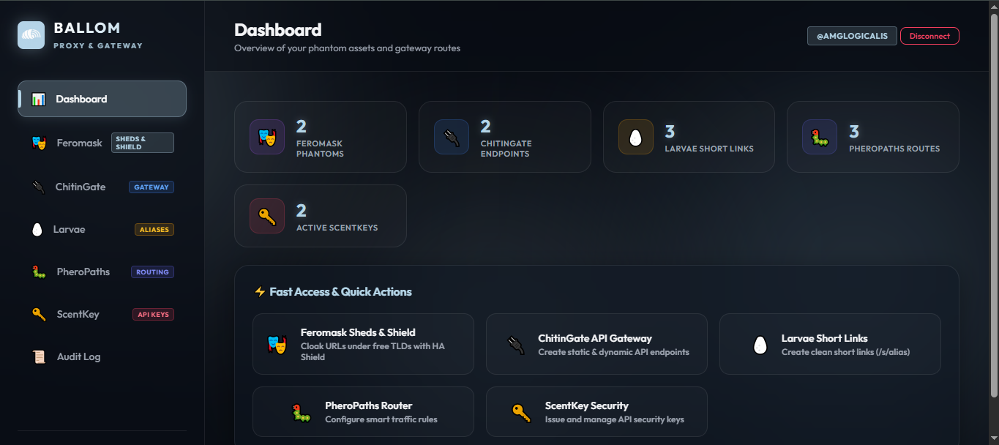

<p align="center">
  
</p>

<h1 align="center">🎭 BALLOM</h1>

<p align="center">
  <b>Terra Ecosystem • Phantom Proxy, Serverless API Gateway & Dynamic DNS Engine at $0 Cost</b>
</p>

<p align="center">
  <a href="https://www.npmjs.com/package/terra-ballom"></a>
  <a href="https://amglogicalis.github.io/ballom-repo-public/"></a>
  <a href="https://github.com/amglogicalis/Ballom"></a>
  <a href="https://opensource.org/licenses/MIT"></a>
</p>

---

## 📸 Web Console Dashboard

<p align="center">
  
</p>

> 🌐 **Live Web Console Online:**  
> 👉 **[https://amglogicalis.github.io/ballom-repo-public/](https://amglogicalis.github.io/ballom-repo-public/)**

---

## 🏛️ What is BALLOM?

**BALLOM** is the advanced hosting, masking, dynamic routing, and API gateway engine of the **Terra Ecosystem** (inspired by *Ballarmadillo* — the roly-poly beetle that mimics ant pheromones). 

It allows developers to host, mask, route, protect, and shorten any web application or API endpoint with **100% Privacy & Security**, **0% 404 Errors**, and **$0 Monthly Server Overhead**.

BALLOM operates on a **Dual-Repository Architecture**:
1. **Private Vault Repository (`.ballom-storage`)**: Encrypted Git storage containing state, audit logs, and API key hashes.
2. **Public CDN Repository (`ballom-cdn`)**: Fast, distributed GitHub Pages CDN serving static endpoints, redirection files, and cloaked entrypoints.

---

## ⚡ Key Features & Core Engines

BALLOM is composed of **5 specialized micro-engines**:

### 1. 🎭 **Feromask — Phantom URL Cloaking & HA Shield**
- **Domain Camouflage**: Mask any application URL (Vercel, AWS, S3, Netlify, WEBBL Cocoon) under aesthetic free community domains (`.is-a.dev`, `.is-an.app`, `.1337.cx`, `.js.org`, `.sub.id`, `.eu.org`, `.github.io`) or custom owned domains (`.com`, `.es`).
- **Metadata Cloaking**: Injects custom SEO titles, OpenGraph descriptions, and favicon overrides on the fly.
- **🛡️ BackSheds HA Failover**: Auto-switches to a backup failover URL if the primary target source becomes unavailable.
- **Idle Timeout Shield**: Automated idle shutdown timers (5, 15, 30, 60 minutes) to conserve build minutes.

### 2. 🔌 **ChitinGate — $0 Serverless API Gateway**
Build production-ready API Endpoints across 3 serverless operational modes:
- 🟢 **Static Mode (`static`)**: Serves JSON data directly from global CDN (`ballom-cdn/endpoints/.../index.json`) with **0ms server delay** and **$0 cost**. Ideal for feature flags, app configs, and mocks.
- 🟡 **Actions Mode (`actions`)**: Dispatches asynchronous **GitHub Actions** workflows when receiving HTTP requests. Includes customizable **Workflow Inputs / Payload Schema JSON** (`{"environment": "production", "notify_slack": true}`).
- 🔵 **Morph Mode (`morph`)**: Reverse proxies real-time dynamic requests to WEBBL Morph serverless functions or Cloudflare Workers.

### 3. 🥚 **Larvae — Dynamic Short Links with Flexible Prefixes**
- **Custom Prefix Selector**: Create short links under any route mode:
  - `/s/` (Standard Short Link — `/s/slug`)
  - `/a/` (Alias Direct — `/a/slug`)
  - `/go/` (Go Redirect — `/go/slug`)
  - `/link/` (Resource Link — `/link/slug`)
  - `/` (Root Direct — `/slug`)
- **Click Analytics**: Tracks total click counts and last click timestamps.
- **Expiration Control**: Set automatic expiration dates on links.

### 4. 🐛 **PheroPaths — Intelligent Routing Engine**
- **Rule Matching**: Match incoming request paths by `Exact Path`, `Prefix (*)` or `Regular Expression`.
- **Advanced Actions**: `Proxy` (transparent forwarding), `Redirect` (301 status), `Rewrite` (internal router), `Phantom` (cloak), `Webhook` (trigger HTTP events), and `Custom Headers` (inject JSON key-value headers).
- **Priority & Fallback**: Evaluates rules by priority order with automatic fallback destination support.

### 5. 🔑 **ScentKeys — API Key Management & Purge System**
- **Cryptographic Security**: Issues raw keys once (`sck_live_...`) and stores only SHA-256 hashes in Vault.
- **Granular Custom Scopes**: Combine standard permissions (`read`, `write`, `gateway:invoke`, `larvae:create`, `domain:manage`, `*`) with free-text custom scopes (e.g., `billing:read`, `users:delete`, `analytics:export`).
- **Purge System**: Delete individual revoked keys or purge all inactive key records with a single click.

---

## 📦 Installation & Setup

### Option 1: Global NPM Installation (Recommended)

Install `terra-ballom` globally to access the `ballom` CLI command anywhere on your system:

```bash
# Install package globally via npm
npm install -g terra-ballom

# Verify CLI installation
ballom --version
```

### Option 2: Instant NPX Usage (Zero Installation)

Run BALLOM CLI commands directly without global installation:

```bash
# Launch live web console
npx terra-ballom console

# Run CLI commands directly
npx terra-ballom feromask list
```

---

## 🔑 Authentication

Set your GitHub Personal Access Token (PAT) with `repo` permissions as an environment variable:

```bash
# On Linux / macOS
export GITHUB_TOKEN="ghp_your_github_personal_access_token"

# On Windows PowerShell
$env:GITHUB_TOKEN="ghp_your_github_personal_access_token"
```

---

## 💻 CLI Commands Reference

### 🌐 Launch Web Console
```bash
ballom console
```

### 🎭 Feromask (Phantom Cloaking)
```bash
# Create a cloaked phantom URL
ballom feromask create --target https://my-app.vercel.app --domain tienda.is-a.dev --title "Mi Tienda Online"

# List active phantoms
ballom feromask list

# Delete a phantom
ballom feromask delete --id ph_xyz123
```

### 🔌 ChitinGate (API Gateway)
```bash
# Create a static JSON endpoint ($0 cost)
ballom endpoint create --path /api/v1/config --mode static --data '{"status":"ok","version":"1.0"}'

# Create a GitHub Actions workflow endpoint
ballom endpoint create --path /api/v1/deploy --mode actions --workflow deploy-prod

# List all endpoints
ballom endpoint list

# Delete an endpoint
ballom endpoint delete --id ep_xyz123
```

### 🥚 Larvae (Short Links & Aliases)
```bash
# Create a short link with custom prefix
ballom alias create --target https://docs.terra.dev/long-url --slug docs --prefix go

# List all short links
ballom alias list

# Resolve a short link destination
ballom alias resolve --slug docs

# Delete a short link
ballom alias delete --slug docs
```

### 🐛 PheroPaths (Intelligent Router)
```bash
# Create a routing rule with custom headers
ballom route create --name "API Forwarder" --pattern "/v1/*" --match prefix --action proxy --dest "https://backend.com" --priority 5

# Test path evaluation against active rules
ballom route eval --path "/v1/users"

# List all routing rules
ballom route list
```

### 🔑 ScentKeys (API Key Management)
```bash
# Issue a new API key with custom scopes
ballom key create --name "Billing Service" --scopes "read,billing:read,users:delete" --env live

# List all ScentKeys
ballom key list

# Revoke a key
ballom key revoke --id skid_xyz123

# Delete a revoked key record
ballom key delete --id skid_xyz123

# Purge all revoked key records at once
ballom key purge

# Rotate a key (revokes old and issues new raw key)
ballom key rotate --id skid_xyz123
```

---

## 🛠️ Node.js / TypeScript SDK Usage

You can install `terra-ballom` in your Node.js or TypeScript backend project:

```bash
npm install terra-ballom
```

Import and use `Ballom` in your code:

```typescript
import { Ballom } from 'terra-ballom';

const ballom = new Ballom({
  githubToken: process.env.GITHUB_TOKEN!
});

// Initialize state from private Vault
await ballom.init();

// 1. Create a cloaked Phantom URL
const phantom = await ballom.createPhantom(
  'https://my-app.vercel.app',
  'tienda.is-a.dev',
  'iframe',
  { title: 'My Store', description: 'Hosted on Terra' }
);

// 2. Create a Short Link with root direct path
const alias = await ballom.createAlias('https://docs.terra.dev/section', {
  slug: 'docs',
  prefix: 'root'
});
console.log('Short URL:', alias.shortUrl); // -> /docs

// 3. Issue an API Key with custom scopes
const key = await ballom.createScentKey(
  'Microservice Key',
  ['read', 'billing:read', 'analytics:export'],
  { env: 'live' }
);
console.log('Raw Key (save this!):', key.rawKey);
```

---

## 🚀 Publishing to NPM

To publish a new version of the package to the global npm registry:

```bash
# Build the TypeScript SDK and CLI
npm run build --workspace=packages/ballom-sdk

# Navigate to package directory
cd packages/ballom-sdk

# Publish publicly to npm
npm publish --access public
```

---

<p align="center">
  <b>Powered by Terra Ecosystem • $0 Monthly Hosting • MIT License</b>
</p>
